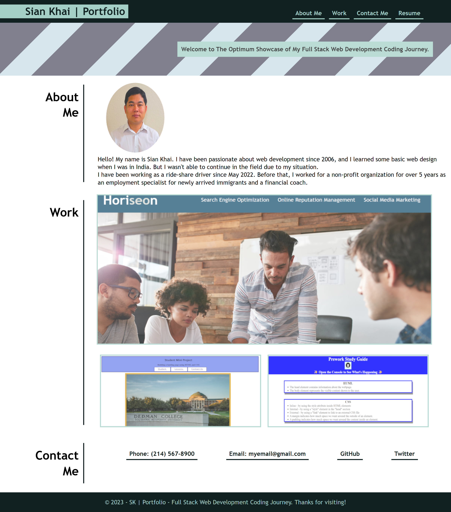

# Sian Khai | Portfolio Responsive Design

## Table of Contents

- [Description](#description)
- [Projects](#projects)
- [Code Languages](#code-languages)
- [Installation](#installation)
- [Usage](#usage)

## Description

This project is to create a responsive portfolio for myself that includes information about me, a showcase of my full-stack web development projects, and my contact information.
I have added a few projects and will add more as the classes go on.

## Projects

- Prework Study Guide | [Click here to visit!](https://skhai77.github.io/prework-study-guide/)
- First Mini Project  | [Click here to visit!](https://skhai77.github.io/stu-mini-project/)
- Horiseon Page's codes Refactored  | [Click here to visit!](https://skhai77.github.io/horiseon-code-refact/)
- CSS Snippet Cheat Sheet (Coming soon!)
- JavaScript (Coming soon!)

## Code Languages

- HTML
- CSS
- JavaScript

## Installation

- Not required.
- You can view the screenshot or live website in the Usage section, below.

## Usage

- It is a normal webpage and no particular instruction is needed.
- Preview the homepage or visit the live website by
 [clicking here, Sian Khai's Portfolio](https://skhai77.github.io/siankhai-portfolio-responsive/).

